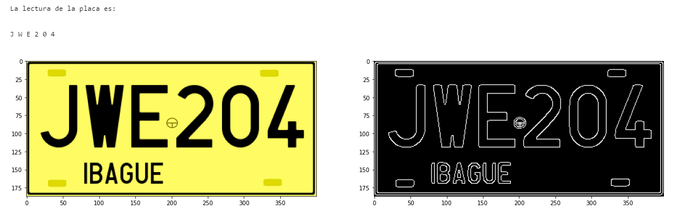




# Lectura de placas vehiculares en Colombia a partir de imágenes generadas digitalmente

Este proyecto es realizado con el fin de implementar herramientas de aprendizaje automático, por ello se generaron 1000 imágenes de placas con sus letras y números aleatorios con el objetivo de entrenar el clasificador seleccionado, y otras 300

## Contenido
En la carpeta "src" encontrará los algoritmos implementados para el desarrollo de este proyecto
* Para visualizar el resultado final y realizar un test de su funcionamiento, dirigirse a: Entrenamiento_y_validacon.ipynb  , o el mismo en extensión .py
* Para visualizar el método de segmentación y adquisición de características, dirigirse a: gen_datos.ipynb
* Si desea realizar una nueva generación de datos para realizar un entrenamiento y test del clasificador implementado para realizar la lectura de la imagen, dirigirse a: gen_datos.ipynb  

En la carpeta "data" se ubican
* training, en esta se encuentran las 1000 imágenes utilizadas para entrenar el sistema  y su equivalente numérico como documento .csv
* testing, en esta se encuentran las 300 imágenes y su equivalente numérico como documento .csv

## Demo
Prueba del algoritmo



Markdown has enumation and nested lists.

## Instalación
Librerías utilizadas para este proyecto
```bash
pip install numpy
pip install pandas
pip install opencv-python
pip install requests
pip install unidecode
pip install imageio
pip install -U scikit-learn
```
Para la ejecución de este proyecto se recomienda utilizar una máquina local, ya que la gestión de carpetas se encuentra configurada con rutas locales.
## Recomendaciones
Si desea generar una nueva base de datos, se recomienda utilizar un ordenador de altas frecuencias, o ejecutar el código en GPU y si se encuentra en Google Colab, utilizar hardware especializado tal como el TPU.
#### Universidad de Ibagué
#### Programa de Ingeniería Electrónica
#### Inteligencia Artificial 2021A
Authors:
- Bryan Castro Lugo
- Gildardo Hernandez Palma

Tutor:
[Harold Murcia] 

### Respaldo
Archivos de respaldo en Google Drive: https://drive.google.com/drive/folders/1Z2IzfrJ4wGLKoQrLRwDAwbUttjUTIj_P?usp=sharing
